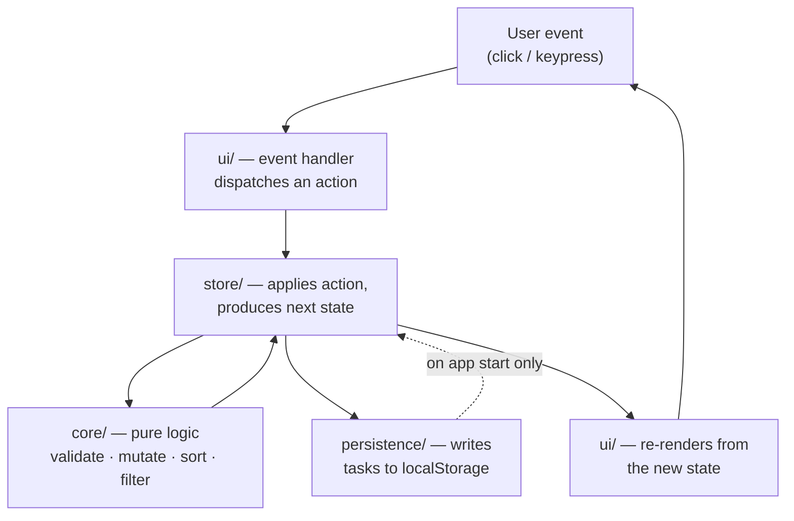

# Task Tracker

A standalone, client-side personal task tracker. No account, no server, no sync — open the page and start capturing tasks. Everything is stored in your own browser.

[](https://github.com/Nandan-krishnamurthy/task-tracker/actions/workflows/deploy.yml)

**▶ Live demo: https://nandan-krishnamurthy.github.io/task-tracker/**

**Repository: https://github.com/Nandan-krishnamurthy/task-tracker**

---

## What this application does

Most to-do tools are built for teams: they ask you to create an account and sign in before you can write down a single task. Task Tracker is the inverse. It is one page for one person's personal to-do list.

You open it, type a task, and it is saved. Close the tab, come back tomorrow in the same browser, and your tasks are still there — unchanged, with no import, unlock, or restore step. There is no backend, so nothing to sign up for and nothing to go down.

A task has exactly four user-facing attributes: **title** (required), **due date** (optional), **priority** (optional), and **complete / incomplete status**. That list is deliberately closed — there are no notes, tags, projects, or assignees.

## Features

- **Create a task** with a required, non-empty title
- **Optional due date**, set at creation or later via edit
- **Optional priority** — exactly three levels: Low, Medium, High
- **Complete and reopen** tasks with a checkbox
- **Edit** a task's title, due date, and priority (completed tasks are editable too)
- **Delete** a task immediately, with no confirmation step
- **Separate Active and Completed views** — the app opens on Active; there is no combined "all" view
- **Automatic sorting** — due date ascending (soonest first), tasks with no due date last, with a deterministic tie-break so ordering is identical across reloads
- **Validation** — empty or whitespace-only titles are rejected with a visible, screen-reader-announced message, on both create and edit
- **Persistence** in `localStorage`, written synchronously on every change
- **Graceful degradation** — corrupt or unavailable storage yields an empty, usable list instead of a crash
- **Keyboard accessible** — every control is operable by keyboard alone with an accessible label that names both the action and the task it acts on

## Technology stack

| Concern | Choice |
| --- | --- |
| Language | TypeScript (ES2020 target) |
| Build / dev server | Vite 6 |
| UI framework | **None** — vanilla DOM |
| Styling | One plain CSS file |
| Unit & DOM tests | Vitest 5 (+ jsdom) |
| End-to-end tests | Playwright |
| Hosting | GitHub Pages (static) |
| CI/CD | GitHub Actions |

**Runtime dependencies: zero.** `dependencies` in `package.json` is empty and enforced as such by a test. Everything above is a dev dependency; the shipped artifact is HTML, CSS, and one JS bundle.

Why no UI framework: the entire UI is one form, one list, and a two-option filter. The genuinely hard parts here are ordering, persistence failure modes, and accessible focus management — a framework helps with none of them. The trade-off (hand-written rendering means focus preservation is our problem) is documented and addressed in [ADR-0002](docs/adr/0002-no-ui-framework-vanilla-typescript.md).

## Architecture and data flow

A single-page, single-view application built as a **unidirectional loop** across four layers. There is no router and no network layer.



The rule that makes this work: **the UI never mutates state and never touches storage.** It dispatches actions and renders what it is given. Storage is read once at startup and written after every change.

| Layer | Directory | Responsibility | Knows about |
| --- | --- | --- | --- |
| Core | `src/core/` | Pure domain logic: types, validation, sorting, filtering, task mutation. No DOM, no side effects. | Nothing |
| Persistence | `src/persistence/` | Read, write, and decode the stored payload. The **only** code that touches `localStorage`. | Core types |
| Store | `src/store/` | Holds the single state object, applies actions, notifies subscribers, triggers persistence. | Core, Persistence |
| UI | `src/ui/` | Renders state to the DOM, wires events to actions, manages focus. | Core types, Store |
| Composition | `src/main.ts` | Wires the four together at startup. | All |

Dependencies point **inward only** — `core/` imports nothing from its siblings, which is what makes the sorting, filtering, and validation rules testable with no browser at all.

Validation runs inside the reducer, not in the UI, so it cannot be bypassed by dispatching an action directly. Sort order is derived at render time and never stored.

## Project structure

```
task-tracker/
├── .github/workflows/deploy.yml   # GitHub Pages deployment
├── docs/                          # Requirements, architecture, ADRs, traceability
│   └── adr/                       # ADR-0001 .. ADR-0008
├── src/
│   ├── core/                      # types, validation, sort, filter, tasks (pure)
│   ├── persistence/               # storage.ts (localStorage), schema.ts (decoder)
│   ├── store/                     # store.ts, actions.ts
│   ├── ui/                        # app, taskForm, filterBar, taskList, taskItem, focus
│   ├── main.ts                    # composition root
│   └── styles.css
├── tests/
│   ├── unit/                      # Vitest, node, no DOM
│   ├── dom/                       # Vitest + jsdom, storage faked
│   ├── e2e/                       # Playwright, real browser
│   └── support/                   # shared fixtures and helpers
├── index.html                     # semantic page skeleton
├── Task Tracker.pdf               # the approved PRD (source of truth)
└── vite.config.ts · vitest.config.ts · playwright.config.ts
```

## Running locally

**Prerequisites:** Node.js 22 or newer (CI builds on Node 22) and npm.

```bash
git clone https://github.com/Nandan-krishnamurthy/task-tracker.git
cd task-tracker
npm install
npm run dev
```

The dev server starts at **http://localhost:5173**.

To run the end-to-end suite you also need Playwright's browsers once:

```bash
npx playwright install
```

## npm commands

| Command | What it does |
| --- | --- |
| `npm run dev` | Vite dev server on port 5173 |
| `npm run build` | Typechecks, then builds the static bundle into `dist/` |
| `npm run preview` | Serves the production build on port 4173 |
| `npm run typecheck` | TypeScript, app and test configs |
| `npm test` | All Vitest tests (unit + DOM) |
| `npm run test:unit` | Unit tier only |
| `npm run test:dom` | jsdom tier only |
| `npm run test:e2e` | Playwright tier (builds and previews automatically) |
| `npm run test:watch` | Vitest in watch mode |

## Testing

Three tiers, defined in [ADR-0008](docs/adr/0008-three-tier-testing-boundaries.md). The ratio is deliberately bottom-heavy — most logic is pure, so most tests need no browser.

| Tier | Location | Environment | Covers |
| --- | --- | --- | --- |
| **Unit** | `tests/unit/` | Vitest, node, no DOM | `core/` and the pure decoder: validation, the sort comparator, filtering, task mutation, the reducer, and every storage-corruption fixture |
| **DOM** | `tests/dom/` | Vitest + jsdom, storage faked | Store + render + event wiring together, focus management, accessible names, injected storage failures |
| **E2E** | `tests/e2e/` | Playwright, real Chromium against the production build | Only what jsdom cannot honestly verify: real browser restart, keyboard-only traversal, corrupt data in the genuine storage API, network silence, and latency at 500 tasks |

### Current test status

| Suite | Result |
| --- | --- |
| Unit + DOM (Vitest) | **1,295 passing** across 27 files |
| End-to-end (Playwright) | **135 passing** |
| Acceptance-criteria coverage | **85 of 85** criteria mapped to a named passing test (0 uncovered) |
| Post-deployment verification against the live site | **7 of 7** journey checks passing |

Coverage is not maintained by hand: `tests/unit/traceability.test.ts` re-scans the requirements and the suite on every run and fails the build if [docs/05-traceability.md](docs/05-traceability.md) and the tests disagree.

## Deployment

The deliverable is a static bundle, so hosting is deliberately the simplest thing that works: **GitHub Pages**, published by **GitHub Actions**. There is no server tier anywhere in the stack.

### How the pipeline works

Defined in [.github/workflows/deploy.yml](.github/workflows/deploy.yml):

1. **Trigger** — every push to `main`, or a manual run via *Actions → Deploy to GitHub Pages → Run workflow*.
2. **Build job** — checkout, Node 22 with npm cache, `npm ci`, then `npm run build`. Because `build` runs `typecheck` first, a type error fails the deploy instead of shipping.
3. **Upload** — `dist/` is uploaded as a Pages artifact.
4. **Deploy job** — publishes the artifact to GitHub Pages.

Permissions are least-privilege (`contents: read`, `pages: write`, `id-token: write`), and a `pages` concurrency group prevents overlapping deploys.

Vite is configured with `base: './'` so asset paths are relative. The same `dist/` therefore works unchanged at the Pages project sub-path (`/task-tracker/`), at a domain root, and under `npm run preview` — which is why the e2e suite needs no knowledge of where the app is hosted.

### Where to check deployment status

- **Workflow runs:** https://github.com/Nandan-krishnamurthy/task-tracker/actions
- **Pages environment and deployment history:** the repository's *Settings → Pages*, or the `github-pages` environment on the repo home page
- **The badge** at the top of this README reflects the latest run on `main`

### How future changes get deployed

Push to `main`. That is the whole process — the workflow builds, typechecks, and publishes automatically, and the live URL updates when the deploy job finishes.

To roll back, re-run the workflow at an earlier commit or revert the change and push. There is no server-side state to unwind.

## Data persistence and privacy

Tasks are stored in your browser's `localStorage` under a single key, **`task-tracker.v1`**, wrapped in a small versioned envelope:

```json
{ "schemaVersion": 1, "tasks": [ { "id": "…", "title": "…", "dueDate": "2026-10-01",
  "priority": "high", "completed": false, "createdAt": 1758547200000 } ] }
```

`id` and `createdAt` are internal only — never shown, never editable. `createdAt` exists solely to make sort order deterministic.

**Writes are synchronous and immediate.** The store persists inside `dispatch`, before subscribers are notified — no debounce, no `beforeunload` handler. A change that has been dispatched has been saved, so an abrupt tab close or browser crash cannot lose already-saved work.

**Reads happen once, at startup.** If the stored payload is malformed, has an unknown `schemaVersion`, or contains any invalid task, the whole list degrades to empty rather than loading a partial, quietly-wrong list. If storage is unavailable entirely (private mode, blocked site data, quota exceeded), the app runs in memory for the session without crashing.

### Privacy

- **No task data ever leaves your browser.** There is no backend, no API, and no database.
- **No account, sign-in, email address, or personal identifier** is requested or stored.
- **No analytics, telemetry, or tracking** of any kind.
- The app issues **zero network requests** after the initial page load — verified in the e2e suite and again against the live deployment.

## Limitations

These are known and accepted, not defects:

- **One browser, one device.** Tasks live in that browser's storage only. There is no sync and no cross-device access.
- **Clearing browser data deletes everything,** permanently. There is no export, backup, or recovery path.
- **Data is per-origin.** Tasks saved at the `github.io` URL would not follow the app to a different domain.
- **Two tabs open at once may overwrite each other's state.** No multi-tab coordination is built or promised.
- **No undo.** Deletion is immediate and irreversible, with no confirmation step — the literal reading of the requirement.
- **Silent degradation.** If storage is unavailable, or corrupt data degrades the list to empty, the app does not tell you. The requirements specify no such message, so none was invented; both gaps are recorded for a product decision in [architecture §8.1](docs/02-architecture.md).
- **Browser support** is modern evergreen browsers (current and previous release of Chrome, Edge, Firefox, Safari). Performance is validated at 500 tasks; no size cap is enforced in the app.
- Production sourcemaps are published alongside the site, so the source is readable from the live deployment.

## Intentionally out of scope

Building any of the following would be a scope defect, not a bonus:

| | |
| --- | --- |
| User accounts, sign-in, authentication | Syncing across devices or browsers |
| Sharing tasks or assigning them to others | Projects, boards, tags, or grouping |
| Notes or descriptions beyond the title | Notifications or due-date reminders |
| Offline conflict resolution or multi-tab consistency | Any backend, API, or database |

## Development workflow — AI Software Factory

This project was built through a staged pipeline in which each **station** produces a reviewed, written artifact before the next begins. Every document in `docs/` records the station that produced it, its authoritative inputs, and its own definition of done. The governing rule throughout: `Task Tracker.pdf` is the source of truth, and no station may invent product behavior — a gap is logged as an open question rather than assumed.

| Station | Output | Artifact |
| --- | --- | --- |
| 1 — Requirements | The approved PRD restated as testable acceptance criteria; gaps logged as open questions | [docs/01-requirements.md](docs/01-requirements.md) |
| 2 — Architecture | Layers, data model, state, persistence, accessibility, testing boundaries; all Station 1 open questions resolved | [docs/02-architecture.md](docs/02-architecture.md) |
| 3 — Decision records | The eight decisions significant enough to need a rationale on record | [docs/03-architecture-decisions.md](docs/03-architecture-decisions.md) + [docs/adr/](docs/adr/) |
| 4 — Implementation plan | 30 tasks across 7 phases (P0 scaffolding → P6 E2E), each with dependencies, traceability, and a definition of done | [docs/04-plan.md](docs/04-plan.md) |
| 4 — Implementation | The code, plus a generated audit proving every acceptance criterion has a passing test | [docs/05-traceability.md](docs/05-traceability.md) |

Requirements are traceable in both directions throughout: every requirement maps to a journey and to acceptance criteria, and every acceptance criterion maps to the tests that verify it.

## Documentation

| Document | What it covers |
| --- | --- |
| [docs/01-requirements.md](docs/01-requirements.md) | Functional and non-functional requirements, the four user journeys, 85 acceptance criteria, non-goals |
| [docs/02-architecture.md](docs/02-architecture.md) | Layers, data model, state management, sorting, validation, persistence, error handling, accessibility, testing boundaries |
| [docs/03-architecture-decisions.md](docs/03-architecture-decisions.md) | Index of the ADRs and why each decision earned a record |
| [docs/adr/](docs/adr/) | ADR-0001 layering · 0002 no framework · 0003 localStorage · 0004 write-through persistence · 0005 date strings · 0006 all-or-nothing decoding · 0007 deterministic ordering · 0008 testing tiers |
| [docs/04-plan.md](docs/04-plan.md) | The 30-task implementation plan, phases, dependencies, exit criteria |
| [docs/05-traceability.md](docs/05-traceability.md) | Generated coverage table: every acceptance criterion and the tests that verify it |
| `Task Tracker.pdf` | The approved Product Requirements Document — the source of truth |

## Project status

**Complete and deployed.**

- All ten functional requirements and all five non-functional requirements implemented
- 1,295 unit/DOM tests and 135 end-to-end tests passing
- All 85 acceptance criteria covered by named passing tests
- Deployed to GitHub Pages and verified live: page load, task creation, due date and priority, complete/reopen, edit, delete, Active/Completed views, refresh persistence, and confirmed client-side-only operation
