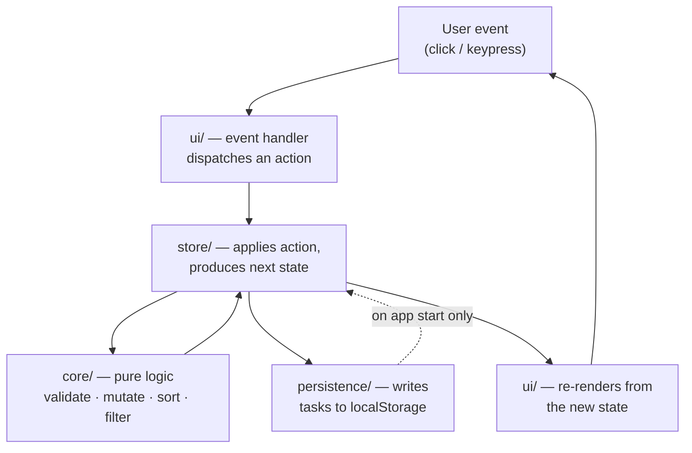
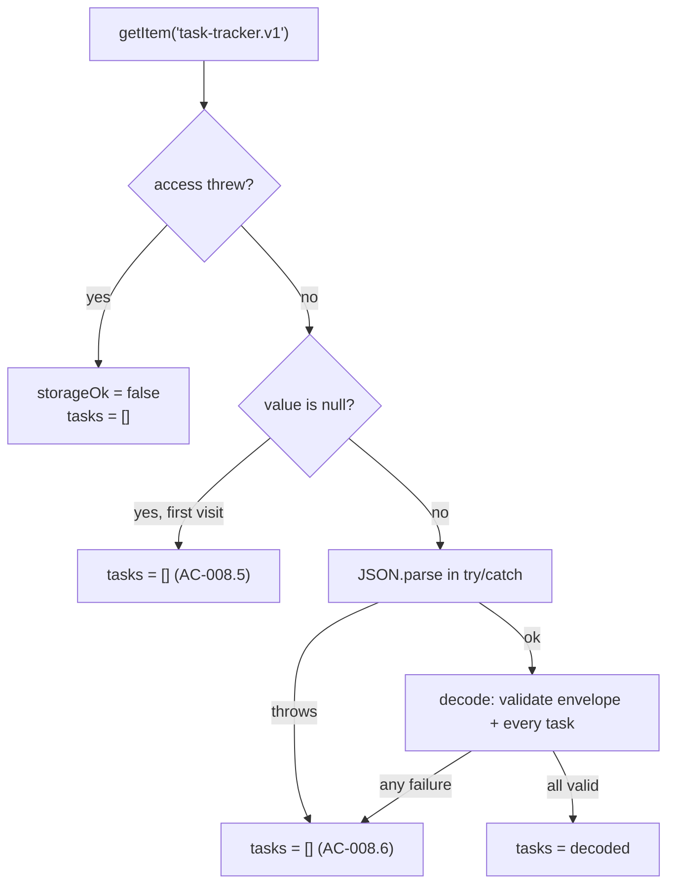

# Task Tracker — Architecture

**Station:** 2 — Architecture
**Inputs (authoritative, in precedence order):**
1. `Task Tracker.pdf` — Product Requirements Document, Status: Approved
2. `docs/01-requirements.md` — Station 1 requirements artifact (approved)

**Artifact status:** Derived. This document defines *how* the approved requirements are met. It introduces no product behavior. Where it appears to disagree with either input, the input wins and this document is corrected.
**Last updated:** 2026-09-23

---

## 0. Architectural principles

Five rules constrain every decision below. They come directly from the approved scope.

| # | Principle | Source |
| --- | --- | --- |
| P1 | **No server, ever.** No backend, API, database, or authentication. The deliverable is static files. | C-01, NG-01, NFR-SEC-001 |
| P2 | **Minimal by default.** Prefer the smallest thing that satisfies a requirement. Every dependency must be justified against a specific `AC`. | User constraint; PRD "standalone client-side web app" |
| P3 | **Logic separate from DOM.** All decision-making (validate, sort, filter, mutate) lives in pure functions independent of the browser, so it is testable without one. | NFR-PERF-001, testing boundaries |
| P4 | **One source of truth in memory; storage mirrors it.** State flows one way. Persistence is a consequence of state change, never a parallel authority. | FR-008, NFR-REL-001 |
| P5 | **Accessibility is structural, not a pass at the end.** Semantic HTML first; ARIA only where semantics run out. | NFR-A11Y-001 |

**Explicitly excluded by these principles:** backend service, REST/GraphQL API, database, authentication/session layer, server-side rendering, state sync, service worker, push notifications, analytics/telemetry.

---

## 1. Application architecture

### 1.1 Shape

A single-page, single-view, client-side application. There is no routing — the app has one screen with a filter toggle, not multiple pages. There is no network layer, because nothing is fetched.

The application is a **unidirectional loop** with four layers:



**The rule that makes this work:** the UI never mutates state and never touches storage. It dispatches actions and renders what it is given. Storage never feeds the UI directly — it is read once at startup and written after every change.

### 1.2 Layers

| Layer | Directory | Responsibility | Knows about |
| --- | --- | --- | --- |
| **Core** | `src/core/` | Pure domain logic: types, validation, sorting, filtering, task creation/mutation. No DOM, no storage, no side effects. | Nothing |
| **Persistence** | `src/persistence/` | Read/write/decode/validate the stored payload. The only code that touches `localStorage`. | Core types |
| **Store** | `src/store/` | Holds the single state object, applies actions, notifies subscribers, triggers persistence. | Core, Persistence |
| **UI** | `src/ui/` | Renders state to DOM, wires events to actions, manages focus. | Core types, Store (dispatch + subscribe) |
| **Composition** | `src/main.ts` | Wires the four together at startup. The only place they meet. | All |

Dependencies point **inward only**. `core/` imports nothing from the other three. This is what makes `AC-010.*`, `AC-009.*` and the sort/filter criteria testable with no browser at all.

### 1.3 Technology choices

| Concern | Choice | Why this, given P2 |
| --- | --- | --- |
| Language | **TypeScript** | The domain has a closed value set (priority ∈ Low/Medium/High, status ∈ active/completed). The compiler enforces C-03 and C-04 at build time — no fourth priority level can be introduced by accident (`AC-003.3`). |
| Build / dev server | **Vite** | Produces a static bundle, which is exactly the deliverable (C-06). Zero-config TypeScript, fast rebuilds. |
| UI framework | **None — vanilla DOM** | This is the significant choice; see §1.4. |
| Styling | **One plain CSS file** | No preprocessor or CSS-in-JS earns its weight at this size. |
| Unit / DOM tests | **Vitest** (+ `jsdom` for DOM-level tests) | Shares Vite's transform pipeline; no second build config. |
| End-to-end tests | **Playwright** | The only way to honestly verify J4 (real browser restart), keyboard-only operation, and corrupted-storage recovery. See §10.3. |

**Runtime dependencies: zero.** Everything above is a dev dependency. The shipped artifact is HTML, CSS, and one JS bundle.

### 1.4 Why no UI framework

React, Vue, or Svelte would each work. None is *needed* here, and each costs something against P2:

- The entire UI is one form, one list, and a two-option filter. There is no component tree deep enough for a framework's reconciliation to pay for itself.
- The hard parts of this app are **ordering** (FR-010), **persistence and its failure modes** (FR-008, NFR-SUP-001), and **accessible focus management** (NFR-A11Y-001). A framework helps with none of them; virtual-DOM re-rendering actively complicates the third.
- `NFR-PERF-001` (under 100ms) is met trivially by direct DOM writes at this data size.
- Zero runtime dependencies means zero supply-chain surface and nothing to keep upgraded for a static app with no server behind it.

**The trade this accepts:** rendering is hand-written, so focus preservation across re-render is our problem rather than the framework's. §4.3 and §9.4 address it explicitly, and it is the main risk this choice carries.

**If this is overturned:** the layer boundaries in §1.2 are framework-independent. Swapping `src/ui/` for React components would leave `core/`, `store/`, and `persistence/` untouched, and every unit test with them.

---

## 2. Task data model

### 2.1 In-memory shape

Derived directly from §2 of `01-requirements.md`, which fixes the attribute list as closed.

| Field | Type | Nullable | Notes |
| --- | --- | --- | --- |
| `id` | `string` | No | Opaque unique identifier. Internal; never shown to the user. Generated via `crypto.randomUUID()`. |
| `title` | `string` | No | Non-empty after trimming. |
| `dueDate` | `string \| null` | Yes | ISO calendar date, `YYYY-MM-DD`. **Date-only, no time, no timezone.** |
| `priority` | `'low' \| 'medium' \| 'high' \| null` | Yes | Closed union; enforced by the compiler (C-04). |
| `completed` | `boolean` | No | `false` = active, `true` = completed. |
| `createdAt` | `number` | No | Epoch milliseconds. Internal; never shown. Exists solely as a deterministic sort tie-break. |

`id` and `createdAt` are internal fields introduced to satisfy requirements, which §2 of `01-requirements.md` permits: *"Internal identifiers or timestamps needed to satisfy a requirement are an implementation concern for Station 2, not user-facing product behavior."* Neither is rendered, editable, or filterable. They add no product behavior.

**Why no more fields.** No `updatedAt`, no `completedAt`, no `order`, no `tags`, no `notes`. C-03 closes the attribute list, and NG-04/NG-05 forbid grouping and descriptions. Nothing in FR-001–FR-010 requires them.

### 2.2 Why `dueDate` is a plain date string, not a `Date`

Three reasons, in order of importance:

1. **No timezone bugs.** A `Date` is an instant in time; a due date is a calendar day. Storing `Date` means a task due "March 3" can render as March 2 for a user whose clock crosses midnight UTC. `YYYY-MM-DD` has no such failure mode.
2. **It sorts correctly as a string.** ISO date strings compare lexicographically in the same order they compare chronologically, so `AC-010.1` needs no date parsing in the comparator.
3. **It serializes losslessly.** `JSON.stringify` round-trips it unchanged, which matters for `AC-008.1`.

The native `<input type="date">` produces and consumes exactly this format, so no conversion is needed at the boundary.

### 2.3 Application state

```
AppState {
  tasks:       Task[]                       // the only persisted slice
  filter:      'active' | 'completed'       // which view is shown (FR-007)
  editingId:   string | null                // which task is in edit mode, if any
  formError:   string | null                // validation message for the create form (FR-009)
  editError:   string | null                // validation message for the edit form (AC-005.6)
  storageOk:   boolean                      // false if storage is unavailable (AC-SUP.2)
}
```

**Only `tasks` is persisted.** `filter`, `editingId`, the two error fields, and `storageOk` are session state — they describe what the user is currently doing, not what they have recorded. Persisting them would resurrect a half-finished edit or a stale error message on reload, which J4 does not ask for and `AC-008.1` does not sanction ("same titles, statuses, due dates, and priorities" — nothing about UI mode).

`tasks` is held **unsorted, in insertion order**. Sorting is applied at render time (§5.1). Keeping the stored array in insertion order means the sort rule can change without a data migration, and `createdAt` stays meaningful.

---

## 3. State management approach

### 3.1 A small hand-written store

No state library. The store is roughly forty lines:

- holds one `AppState` object
- exposes `getState()`, `dispatch(action)`, `subscribe(listener)`
- on dispatch: computes the next state via a pure reducer, persists if `tasks` changed, then notifies subscribers

**Why a reducer rather than scattered mutation:** it puts every state transition in one file, where it can be unit-tested without a DOM. It is the pattern Redux popularized, minus Redux.

### 3.2 Action set

Exactly the transitions FR-001–FR-010 require — no more:

| Action | Payload | Satisfies |
| --- | --- | --- |
| `LOAD` | `Task[]`, `storageOk` | FR-008, AC-008.3 |
| `CREATE_TASK` | `{ title, dueDate, priority }` | FR-001, FR-002, FR-003 |
| `TOGGLE_COMPLETE` | `{ id }` | FR-004 |
| `UPDATE_TASK` | `{ id, title, dueDate, priority }` | FR-005, FR-002, FR-003 |
| `DELETE_TASK` | `{ id }` | FR-006 |
| `SET_FILTER` | `'active' \| 'completed'` | FR-007 |
| `BEGIN_EDIT` / `CANCEL_EDIT` | `{ id }` / — | FR-005 (UI mode only) |

`CREATE_TASK` and `UPDATE_TASK` run validation inside the reducer and either apply the change or set the relevant error field. Validation is never bypassable by dispatching directly — that is what makes `AC-009.1` and `AC-005.6` structural rather than a UI courtesy.

### 3.3 Persistence trigger

The store writes to storage **synchronously, immediately after any action that changed `tasks`** — inside `dispatch`, before subscribers are notified.

This is the direct answer to `AC-REL.3`: *"Persistence is not deferred to page-unload alone, since an unload handler is not guaranteed to run on a crash."* There is no debounce, no `beforeunload` handler, no idle callback. A write that has been dispatched has been persisted.

`localStorage.setItem` is synchronous and sub-millisecond at this payload size, so this costs nothing against `NFR-PERF-001`. Writing on every keystroke would be a different matter — but no action fires per keystroke; actions fire on submit and on button press.

---

## 4. Frontend structure

### 4.1 Single view

```
┌────────────────────────────────────────────┐
│  Task Tracker                     <h1>     │
├────────────────────────────────────────────┤
│  Create form                      <form>   │
│   [ title            ] [date] [pri] [Add]  │
│   validation message (aria-live)           │
├────────────────────────────────────────────┤
│  Filter:  [ Active ] [ Completed ]         │
├────────────────────────────────────────────┤
│  Task list                        <ul>     │
│   ☐ Title      due · priority  [Edit][Del] │
│   ☐ Title      due · priority  [Edit][Del] │
│   (empty state when the view has no tasks) │
└────────────────────────────────────────────┘
```

### 4.2 UI modules

| Module | Renders | Key requirement |
| --- | --- | --- |
| `ui/app.ts` | Top-level render; subscribes to the store | — |
| `ui/taskForm.ts` | Create form + its validation message | FR-001, FR-002, FR-003, FR-009 |
| `ui/filterBar.ts` | Active / Completed toggle | FR-007 |
| `ui/taskList.ts` | The `<ul>`, empty states | FR-007, FR-010 |
| `ui/taskItem.ts` | One `<li>`: checkbox, title, due date, priority, Edit, Delete; and the inline edit form | FR-004, FR-005, FR-006 |
| `ui/focus.ts` | Focus capture/restore across re-render | NFR-A11Y-001 |

These are plain functions returning or updating DOM — not a component framework.

### 4.3 Rendering strategy

**Full re-render of the list region on every state change.** The form and filter bar are rendered once and updated in place; only the `<ul>` is rebuilt.

Why full rebuild is acceptable: the list is small, the work is O(n) DOM creation, and `NFR-PERF-001` has enormous headroom at realistic sizes. Why it is not free: **rebuilding the list destroys keyboard focus**, which would break `AC-A11Y.3` and `AC-A11Y.4` — a user who tabs to a checkbox and presses Space would lose their place on every toggle.

**Mitigation (mandatory, not optional):** every focusable element carries a stable `data-focus-key` (e.g. `task:<id>:toggle`, `task:<id>:delete`, `form:title`). `ui/focus.ts` records the active element's key and its cursor position before the rebuild and restores both after. Where the focused element no longer exists — the common case being *the user just deleted the task they were focused on* — focus moves to a defined fallback: the next task's Delete button, or the create-form title input if the list is now empty.

This is the one piece of mechanism the no-framework choice obliges us to write ourselves. §10.2 requires it to be covered by DOM tests.

---

## 5. Sorting and filtering behavior

### 5.1 Derived at render, never stored

`tasks` is stored in insertion order. On each render the visible list is computed:

```
visible = sort( tasks.filter( t => filter === 'active' ? !t.completed : t.completed ) )
```

Filter first, then sort — same result either way, less work in that order. The result is never written back into state or storage. This makes `AC-010.3` (a new task lands in its correct sorted position) and `AC-010.4` (re-sort after a due-date edit) fall out automatically: there is no cached order that can drift.

### 5.2 The comparator

Four keys, applied in order (`core/sort.ts`):

| # | Key | Rule | Satisfies |
| --- | --- | --- | --- |
| 1 | Has due date | Tasks **with** a due date sort before tasks **without** one | AC-010.2 |
| 2 | Due date | Ascending lexicographic on `YYYY-MM-DD` (= chronological) | AC-010.1, AC-010.6 |
| 3 | `createdAt` | Ascending — older task first | Tie-break (OQ-01, OQ-02) |
| 4 | `id` | Ascending lexicographic | Final determinism guard |

Key 3 resolves `OQ-01` (two tasks sharing a due date) and `OQ-02` (ordering among undated tasks): both fall through to creation order, which is stable, intuitive, and reproducible across reloads — satisfying `AC-010.7`. Key 4 exists because two tasks created in the same millisecond are possible; without it, order would depend on `Array.prototype.sort` implementation details.

**Priority does not participate in ordering.** This upholds `AC-003.7` and the approved decision "Default task list order", which names due date only. Priority is display metadata.

**Past due dates are not special-cased.** `AC-010.6`: an overdue task sorts ahead of nearer-future ones by the same ascending rule. No "overdue" grouping, styling rule, or badge is specified by the PRD, so none is introduced (adding one would brush against NG-06).

### 5.3 Filtering

The filter is a single state field with two values. There is **no combined "all" view** — resolving `OQ-05` in favour of the literal reading of FR-007, which requires the two sets be viewable separately and names no third view. The app opens on **Active**, because DO-1 and DO-2 centre on capturing and seeing open work.

The same comparator applies inside both views (`AC-010.5`).

---

## 6. Validation approach

### 6.1 One rule, one function, both paths

`core/validation.ts` exposes a single pure function used by **both** creation and editing:

```
validateTitle(raw: string) -> { ok: true, value: string } | { ok: false, message: string }
```

- Trims leading/trailing whitespace.
- Empty after trimming → `{ ok: false }` with a human-readable message.
- Otherwise → `{ ok: true }` with the trimmed value, which is what gets stored.

Sharing one function between create and edit is what makes `AC-005.6` hold by construction: a task cannot reach an empty title by any route, because there is only one route.

### 6.2 Decisions this encodes

**Whitespace-only titles are rejected** (`AC-009.4`, resolving `OQ-06`). A title of `"   "` is not a "required title" in any useful sense, and would render as a blank row the user cannot identify.

**Trimming does not violate `AC-001.4`.** That criterion requires the title be displayed "exactly as entered, with no truncation or alteration of its *visible* content". Leading and trailing whitespace has no visible content. Interior spacing is preserved untouched.

**No other validation exists.** No maximum title length, no date-range restriction (past due dates are legal — `AC-010.6` assumes them), no required priority. Each would be product behavior the PRD does not specify, and P2 forbids inventing it.

### 6.3 Where errors live and how they clear

Validation failure sets `formError` (create) or `editError` (edit) in state; the corresponding form renders the message. `AC-009.3` — a rejected submit must not force re-entry from scratch — is satisfied because **the form's field values are never cleared on a failed submit**; the user's due date and priority stay exactly where they were. Fields are cleared only on a successful create.

`AC-009.5` — the message clears on the next successful submit — falls out of the reducer setting the error field back to `null`.

---

## 7. Persistence approach

### 7.1 Mechanism and key

`window.localStorage`, single key: **`task-tracker.v1`**.

`localStorage` over the alternatives: it is synchronous (which §3.3 relies on for `AC-REL.3`), survives browser restart (`AC-008.2`), and is the API the PRD itself names in A-01. IndexedDB is asynchronous and vastly more machinery than a task list needs (P2). `sessionStorage` does not survive restart and would fail `AC-008.2` outright. Cookies transmit to servers, violating `NFR-SEC-001`.

### 7.2 Stored envelope

```json
{
  "schemaVersion": 1,
  "tasks": [
    {
      "id": "…",
      "title": "…",
      "dueDate": "2026-10-01",
      "priority": "high",
      "completed": false,
      "createdAt": 1758547200000
    }
  ]
}
```

The envelope exists so that unrecognized data is *detectable* rather than silently misread. C-06 confirms there is no prior format to migrate from, so `schemaVersion` has exactly one job in v1: any value other than `1` is treated as unreadable and handled by §8. No migration code is written now.

### 7.3 Read path (startup, once)



Decoding is total: it never throws, and always returns a valid `Task[]`. Every field is checked — `priority` must be one of the three literals or `null`, `dueDate` must match `YYYY-MM-DD` or be `null`, `title` must be a non-empty string, `completed` must be a boolean.

### 7.4 Write path

`persistence/storage.ts` serializes the whole `tasks` array and writes it under the single key, synchronously, on every mutating action (§3.3). Whole-array rewrite rather than per-task records: simpler, atomic from the reader's perspective, and trivially fast at this size.

Every `setItem` is wrapped in `try/catch`. A failure (quota exceeded, storage blocked) sets `storageOk = false` and **does not throw into the UI** — the app continues to work from memory for the rest of the session (`AC-SUP.2`).

### 7.5 What persistence deliberately does not do

- **No cross-tab synchronization.** No `storage` event listener, no `BroadcastChannel`. NG-07 places multi-tab consistency out of scope; §6 of `01-requirements.md` states the consequence plainly — concurrent tabs may overwrite each other, and that is accepted v1 behavior, not a defect. Adding a listener would be building NG-07.
- **No network anything.** No fetch, no beacon, no service worker (`AC-SEC.1`).
- **No export/import/backup.** Not in FR-001–FR-010.

---

## 8. Error handling for corrupted or unreadable storage

`NFR-SUP-001` requires degrading to an empty list rather than crashing. Three distinct failure modes, three defined behaviors:

| # | Failure | Detection | Behavior | Satisfies |
| --- | --- | --- | --- | --- |
| 1 | **Malformed payload** — invalid JSON, wrong envelope shape, unknown `schemaVersion`, or any task failing field validation | `JSON.parse` throws, or the decoder rejects | App starts with an empty task list and is fully usable; the user can create tasks immediately | AC-008.6, AC-SUP.1, AC-SUP.3 |
| 2 | **Storage unavailable** — access throws (private-mode restrictions, blocked site data) | `try/catch` around `getItem` / `setItem` | `storageOk = false`; app runs entirely in memory for the session; no crash, no broken UI | AC-SUP.2, AC-SUP.3 |
| 3 | **Write rejected** — quota exceeded mid-session | `setItem` throws | Same as #2; in-memory state remains correct and the UI stays responsive | AC-SUP.2 |

**All-or-nothing decoding.** If *any* task in the payload fails validation, the whole list degrades to empty rather than loading the valid subset. This is the literal reading of NFR-SUP-001 and `AC-SUP.1` ("degrade to an empty task list"). Partial recovery — silently dropping some of a user's tasks while keeping others — is unspecified behavior that would produce a *quietly wrong* list rather than an obviously empty one. P2 and "do not invent product behavior" both point the same way.

**No corrupt-data quarantine in v1.** Copying the unreadable payload to a backup key before overwriting was considered and excluded: it is unspecified behavior, and the PRD's own risk table already accepts that local-only persistence has no recovery path.

**No crash path.** Storage access exists in exactly one module (`persistence/storage.ts`), every entry point of which is wrapped. No other module may call `localStorage` — this is a reviewable invariant, and §10 requires a test asserting it.

### 8.1 Two gaps referred back to the product owner

Neither blocks Station 3; both are recorded so the decision is visible rather than accidental.

| Gap | Current architectural default | Why it is flagged |
| --- | --- | --- |
| When storage is unavailable (#2), is the user told their tasks will not be saved? | **No message in v1.** The app stays usable and silent. | The PRD specifies no such message, so adding one would be inventing UI. But silently failing to save conflicts with the *spirit* of DO-3. Worth a product decision. |
| When corrupt data degrades to empty (#1), is the user told? | **No message in v1.** The app shows the normal empty state. | Same reasoning. The user sees an empty list identical to a first visit. |

---

## 9. Accessibility considerations

`NFR-A11Y-001` names five control groups — add task, complete checkbox, edit, delete, filter — and requires all be keyboard-operable with accessible labels. P5 makes this structural.

### 9.1 Semantic HTML first

| Element | Markup | Why |
| --- | --- | --- |
| Create form | `<form>` with a real submit button | Enter-to-submit works for free; `AC-A11Y.4` |
| Title field | `<input type="text">` with a real `<label>` | Programmatic name without ARIA |
| Due date | `<input type="date">` with a `<label>` | Native keyboard-accessible date entry; emits `YYYY-MM-DD` (§2.2) |
| Priority | `<select>` with a `<label>`, options None/Low/Medium/High | Native, keyboard-operable, and structurally incapable of a fourth level (C-04) |
| Complete toggle | `<input type="checkbox">` with a `<label>` | Space toggles natively; matches J2's "e.g., via a checkbox" |
| Edit / Delete | `<button type="button">` | Enter and Space both activate |
| Task list | `<ul>` / `<li>` | Screen readers announce list length and position |

### 9.2 Accessible names must identify the task

`AC-A11Y.2` requires labels that identify both action and target — "delete" alone is ambiguous across twenty rows. Every per-task control's accessible name includes the task title:

- checkbox → `Mark "Buy milk" complete` / `Mark "Buy milk" incomplete`
- edit → `Edit "Buy milk"`
- delete → `Delete "Buy milk"`

Set via `aria-label` on the control, since the visible button text is the short word.

### 9.3 Filter controls

Two `<button>` elements inside a labelled group, each carrying `aria-pressed` to convey which view is current.

**Why not a `tablist`:** the ARIA tabs pattern is arguably the more precise semantic, but it requires roving `tabindex` and arrow-key handling — hand-written mechanism that can be got subtly wrong. Toggle buttons with `aria-pressed` are reachable by Tab alone, need no custom key handling, and fully satisfy `AC-007.6`. P2 favours the simpler correct option over the more precise fragile one.

### 9.4 Focus management

The obligations created by §4.3's full re-render:

| Situation | Required behavior | Satisfies |
| --- | --- | --- |
| Any re-render | Focus is restored to the same logical control via `data-focus-key` | AC-A11Y.3 |
| Task deleted while focused | Focus moves to the next task's Delete button, or to the title input if the list is now empty | AC-A11Y.3, AC-A11Y.4 |
| Edit begun | Focus moves into the edit form's title field | AC-A11Y.4 |
| Edit saved or cancelled | Focus returns to the Edit button of that task | AC-A11Y.4 |
| Task created | Focus returns to the title input, ready for the next task | DO-1, AC-A11Y.4 |

Focus must never be lost to `<body>` after an action. §10.2 requires DOM tests for each row.

### 9.5 Validation messages

`AC-009.6` and `AC-A11Y.5`: the message is rendered in a container with `aria-live="assertive"` and referenced by the title input's `aria-describedby`; the input carries `aria-invalid="true"` while invalid. The message is conveyed by **text**, never by color or position alone.

### 9.6 Baseline

Visible focus indicator on every interactive element, never removed without replacement. Colour contrast meeting WCAG 2.1 AA. Priority conveyed by text or text-plus-colour, never colour alone.

---

## 10. Testing boundaries

Three tiers, each with a clear remit. The ratio is deliberately bottom-heavy: most logic is pure, so most tests need no browser.

### 10.1 Unit — `tests/unit/`, Vitest, no DOM

Covers `core/` and the pure parts of `persistence/`. Fast, exhaustive, the bulk of the suite.

| Target | Criteria covered |
| --- | --- |
| `validateTitle` | AC-001.4, AC-009.1, AC-009.4, AC-005.6 |
| Sort comparator | AC-010.1, AC-010.2, AC-010.5, AC-010.6, and determinism for OQ-01/OQ-02 |
| Filter selector | AC-007.1, AC-007.2, AC-007.3 |
| Task create/update/toggle/delete | AC-001.5, AC-001.6, AC-002.*, AC-003.*, AC-004.4, AC-005.*, AC-006.4 |
| Payload decoder | AC-008.6, AC-SUP.1 — malformed JSON, wrong envelope, bad `schemaVersion`, each invalid field type |
| Reducer | Every action in §3.2 |

### 10.2 DOM / integration — `tests/dom/`, Vitest + jsdom, storage faked

Covers store + render + event wiring together. Storage is an in-memory fake, so failure modes are directly injectable.

| Target | Criteria covered |
| --- | --- |
| Render correctness | AC-001.1, AC-003.6, AC-004.7, AC-007.5, AC-010.3, AC-010.4 |
| Validation surfacing | AC-009.2, AC-009.3, AC-009.5, AC-009.6 |
| Focus management (all §9.4 rows) | AC-A11Y.3 |
| Accessible names | AC-A11Y.2 |
| Storage failure injection | AC-SUP.1, AC-SUP.2, AC-SUP.3 |
| Persistence called on every mutation | AC-008.4 |
| **Invariant:** no module outside `persistence/` references `localStorage` | §8 crash-path guarantee |

### 10.3 End-to-end — `tests/e2e/`, Playwright, real browser

Deliberately few. Reserved for what jsdom cannot honestly simulate.

| Scenario | Criteria covered | Why it must be a real browser |
| --- | --- | --- |
| J1 capture, J2 complete/reopen, J3 edit/delete | AC-001.3, AC-004.2, AC-006.1, AC-006.2 | Real event and render pipeline |
| J4 — reload, and close/reopen the browser context | AC-008.1, AC-008.2, AC-008.3, AC-006.3, AC-010.7 | jsdom cannot restart a browser |
| Keyboard-only traversal of all four journeys | AC-A11Y.1, AC-A11Y.4 | Real focus order and native control behavior |
| Seed corrupt data into real `localStorage`, then load | AC-008.6, AC-SUP.1 | Exercises the genuine storage API |
| Network silence during all journeys | AC-SEC.1, AC-SEC.2, AC-PERF.2 | Requires real network interception |

### 10.4 Out of scope for testing

No API/contract tests, no backend or database tests, no network mocking beyond the silence assertion, no cross-browser sync tests, no multi-tab consistency tests (NG-07 — there is no guarantee to test).

`AC-PERF.3` requires that the perceived-latency bound be validated at a stated list size. **Fixed here at 500 tasks** — well beyond a realistic personal list, and a concrete number in place of A-02's unbounded assumption. This is a test parameter, not a product limit: no cap is enforced in the app.

---

## 11. Project structure

```
task-tracker/
├── Task Tracker.pdf              # PRD — source of truth, never modified
├── docs/
│   ├── 01-requirements.md
│   └── 02-architecture.md
├── index.html                    # single page; app mount point
├── package.json
├── tsconfig.json
├── vite.config.ts
├── playwright.config.ts
├── src/
│   ├── main.ts                   # composition root: wire store + storage + UI
│   ├── styles.css
│   ├── core/                     # pure — no DOM, no storage, no imports from siblings
│   │   ├── types.ts              # Task, Priority, Filter, AppState
│   │   ├── validation.ts         # validateTitle
│   │   ├── sort.ts               # the four-key comparator
│   │   ├── filter.ts             # active / completed selection
│   │   └── tasks.ts              # create / update / toggle / delete (pure)
│   ├── persistence/
│   │   ├── storage.ts            # the ONLY module touching localStorage
│   │   └── schema.ts             # envelope shape + total decoder
│   ├── store/
│   │   ├── actions.ts
│   │   └── store.ts              # state, reducer, dispatch, subscribe, persist hook
│   └── ui/
│       ├── app.ts
│       ├── taskForm.ts
│       ├── filterBar.ts
│       ├── taskList.ts
│       ├── taskItem.ts
│       └── focus.ts
└── tests/
    ├── unit/
    ├── dom/
    └── e2e/
```

**Deployment:** `vite build` emits static assets to `dist/`. Serve from any static host. This is the whole of C-06's "single-stage rollout … ship as a standalone client-side web app"; rollback is redeploying the previous build, with no server state involved.

---

## 12. Resolution of Station 1 open questions

All seven `OQ` items from `01-requirements.md` §8 are non-blocking design gaps. Each is now settled. Formal ADRs are **not** written at this station, per instruction.

| OQ | Question | Resolution | Where |
| --- | --- | --- | --- |
| OQ-01 | Ordering of tasks sharing a due date | `createdAt` ascending, then `id` — deterministic and reproducible | §5.2 |
| OQ-02 | Ordering among tasks with no due date | Same tie-break; the group sorts last | §5.2 |
| OQ-03 | Does priority affect ordering? | **No.** Display metadata only | §5.2 |
| OQ-04 | Confirmation before delete? | **No.** J3 says "immediately"; the PRD names no confirmation | §3.2 — `DELETE_TASK` applies directly |
| OQ-05 | Landing view; is there an "all" view? | Opens on **Active**; **no** combined view | §5.3 |
| OQ-06 | Is a whitespace-only title empty? | **Yes** — trimmed, then rejected if empty | §6.2 |
| OQ-07 | Browser matrix; list-size limit | Modern evergreen browsers (current + previous release of Chrome, Edge, Firefox, Safari), ES2020 target. **No enforced size cap**; perf validated at 500 tasks | §10.3, §10.4 |

---

## 13. Traceability: requirement → architecture

| Requirement | Realized by |
| --- | --- |
| FR-001 Create with required title | `core/tasks.ts`, `core/validation.ts`, `store` `CREATE_TASK`, `ui/taskForm.ts` |
| FR-002 Optional due date | `Task.dueDate` (§2.1, §2.2), create + edit forms |
| FR-003 Optional priority | `Task.priority` closed union (§2.1), `<select>` (§9.1) |
| FR-004 Complete / reopen | `TOGGLE_COMPLETE`, `ui/taskItem.ts` checkbox |
| FR-005 Edit title / due date / priority | `UPDATE_TASK`, inline edit form, shared `validateTitle` |
| FR-006 Delete | `DELETE_TASK`, with focus fallback (§9.4) |
| FR-007 Active vs completed views | `AppState.filter`, `core/filter.ts`, `ui/filterBar.ts` |
| FR-008 Browser persistence, auto-reload | `persistence/` + synchronous write-through (§3.3, §7) |
| FR-009 Empty-title validation message | `core/validation.ts` in the reducer; `aria-live` region (§6, §9.5) |
| FR-010 Due-date ascending, undated last | Four-key comparator, applied at render (§5) |
| NFR-A11Y-001 | §9 in full; enforced by §10.2 and §10.3 tests |
| NFR-SEC-001 | P1 — no network layer exists; asserted by E2E network silence (§10.3) |
| NFR-PERF-001 | No network, direct DOM writes, synchronous storage (§1.4, §3.3) |
| NFR-REL-001 | Synchronous write on every mutation; no unload dependency (§3.3) |
| NFR-SUP-001 | Total decoder + single wrapped storage module (§8) |
| NG-01 … NG-07 | P1 (no auth, no sync, no network); closed `Task` shape (§2.1); no cross-tab listener (§7.5) |

---

## 14. Definition of done for Station 2

- [x] Application architecture defined — unidirectional, four layers, dependencies inward.
- [x] Frontend structure defined — single view, six UI modules, rendering and focus strategy.
- [x] State management defined — one store, explicit action set, persistence trigger.
- [x] Task data model defined — six fields, two internal, closed by C-03/C-04.
- [x] Persistence approach defined — `localStorage`, versioned envelope, synchronous write-through.
- [x] Sorting and filtering defined — derived at render, four-key comparator.
- [x] Validation approach defined — one shared pure function across create and edit.
- [x] Corrupted/unreadable storage handling defined — three failure modes, all-or-nothing decode.
- [x] Accessibility considerations defined — semantic-first, named controls, focus contract.
- [x] Testing boundaries defined — three tiers mapped to acceptance criteria.
- [x] Project structure defined.
- [x] All seven Station 1 open questions resolved.
- [x] No backend, API, database, or authentication introduced.
- [x] No features outside approved scope; no application code written; no ADRs created.
- [x] `Task Tracker.pdf` and `docs/01-requirements.md` unmodified.
