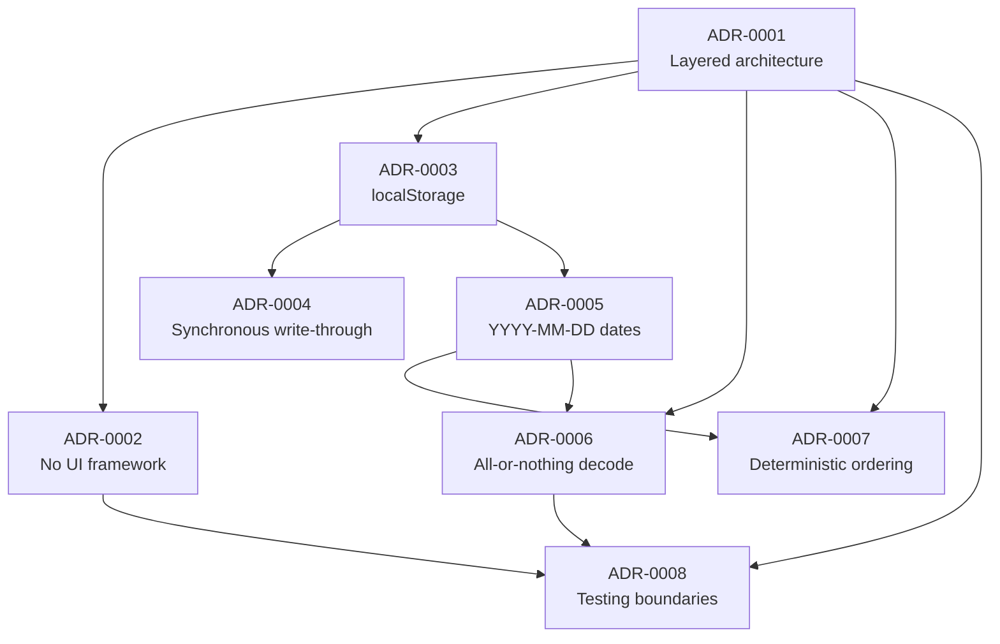

# Task Tracker — Architecture Decision Records (Index)

**Station:** 3 — Architecture Decision Records
**Inputs (authoritative, in precedence order):**
1. `Task Tracker.pdf` — Product Requirements Document, Status: Approved
2. `docs/01-requirements.md` — Station 1 requirements artifact (approved)
3. `docs/02-architecture.md` — Station 2 architecture artifact (approved)

**Records live in:** `docs/adr/`
**Last updated:** 2026-09-23

---

## 0. Purpose and bar for inclusion

An ADR exists to preserve *why* a decision was made, for a reader who arrives later without the discussion that produced it. Recording everything devalues the record; recording nothing loses the reasoning.

The bar applied at this station — a decision earns an ADR if it meets **at least two** of:

1. **A credible alternative was rejected.** Someone reasonable would have chosen differently.
2. **It is costly to reverse.** Undoing it touches multiple modules, the data format, or the test suite.
3. **It will be questioned later.** A future contributor will look at it and ask "why on earth…".
4. **It trades one requirement against another.** The decision resolves a genuine tension rather than simply complying.

Decisions that merely restate an approved constraint — no backend, no auth, no sync — are **not** ADRs. They are not decisions; they are the PRD. They appear in §3 with that reasoning stated.

---

## 1. The records

| ADR | Title | Status | Primary requirements served |
| --- | --- | --- | --- |
| [ADR-0001](adr/0001-layered-architecture-with-inward-dependencies.md) | Layered architecture with inward-pointing dependencies | Accepted | `NFR-SUP-001`, `AC-SUP.1–3`, testability of `AC-010.*` / `AC-009.*` |
| [ADR-0002](adr/0002-no-ui-framework-vanilla-typescript.md) | No UI framework — vanilla TypeScript with Vite | Accepted | `NFR-PERF-001`, `NFR-A11Y-001`, `AC-003.3`, C-06 |
| [ADR-0003](adr/0003-localstorage-as-persistence-mechanism.md) | `localStorage` as the persistence mechanism | Accepted | `FR-008`, `AC-008.1–5`, J4, `NFR-SEC-001` |
| [ADR-0004](adr/0004-synchronous-write-through-persistence.md) | Synchronous write-through persistence on every mutation | Accepted | `NFR-REL-001`, **`AC-REL.3`**, `AC-008.4` |
| [ADR-0005](adr/0005-due-date-as-iso-calendar-date-string.md) | Due dates as `YYYY-MM-DD` calendar-date strings | Accepted | `FR-002`, `FR-010`, `AC-008.1`, `AC-010.1` |
| [ADR-0006](adr/0006-all-or-nothing-decoding-of-stored-data.md) | All-or-nothing decoding of stored data | Accepted | `NFR-SUP-001`, `AC-SUP.1–3`, `AC-008.6` |
| [ADR-0007](adr/0007-deterministic-ordering-derived-at-render.md) | Deterministic ordering, derived at render time | Accepted | `FR-010`, `AC-010.1–7`, `AC-003.7` |
| [ADR-0008](adr/0008-three-tier-testing-boundaries.md) | Three-tier testing boundaries | Accepted | All acceptance criteria — assigns each a verification home |

All eight are **Accepted**. None supersedes another. Each carries Context, Decision, Alternatives considered, Consequences (positive / negative / neutral), Requirement and acceptance-criteria references, and a *Revisit if* trigger.

---

## 2. Evaluation of the six decisions named in the station brief

The brief asked that six decisions in particular be assessed for ADR-worthiness. All six cleared the bar, for the reasons below.

| Decision | ADR | Why it qualifies |
| --- | --- | --- |
| No UI framework / vanilla TypeScript | **ADR-0002** | Criteria 1, 3, 4. React, Svelte, and Lit were all credible; a future contributor will certainly ask why none was used; and it trades framework convenience against hand-written focus management — the single largest risk in the architecture. |
| `localStorage` as persistence | **ADR-0003** | Criteria 1, 2, 4. IndexedDB was a real contender; changing later means changing the data format *and* reopening ADR-0004, because the synchronous API is what makes write-through possible. |
| Synchronous persistence after mutations | **ADR-0004** | Criteria 1, 3, 4. Debouncing is the conventional optimization, and a future contributor may well try to add it — the ADR records that `AC-REL.3` forbids it by name. Trades a small performance cost for a guarantee. |
| Layered architecture / dependency direction | **ADR-0001** | Criteria 1, 2, 3. Flat and feature-sliced layouts were both plausible; the layering is load-bearing for the `NFR-SUP-001` guarantee and for the test pyramid, and reversing it touches every module. |
| `YYYY-MM-DD` date representation | **ADR-0005** | Criteria 1, 2, 3. `Date` is the default reflex and would be reintroduced by anyone who has not read this; changing later is a stored-data migration. |
| All-or-nothing corrupted-data handling | **ADR-0006** | Criteria 1, 3, 4. Partial recovery is what most developers would implement, and it looks kinder — the ADR records why losing *more* data loudly beats losing *less* data silently. |

One further decision cleared the bar and was recorded on its own initiative:

| Decision | ADR | Why |
| --- | --- | --- |
| Deterministic ordering, derived at render | **ADR-0007** | Criteria 1, 3, 4. It closes three Station 1 open questions (`OQ-01`, `OQ-02`, `OQ-03`) and introduces `createdAt` — a field the PRD never asked for — solely to guarantee `AC-010.7`. Without the record, a later reader would reasonably delete it. |
| Three-tier testing boundaries | **ADR-0008** | Criteria 1, 3. E2E-only and unit-only are both defensible strategies; the record explains why Playwright is carried for exactly five scenarios and why multi-tab consistency is deliberately untested. |

---

## 3. Decisions evaluated and deliberately **not** given an ADR

Recorded here so the omission is visible and deliberate rather than an oversight.

| Decision | Where it lives | Why no ADR |
| --- | --- | --- |
| No backend, API, database, or authentication | Architecture P1, §1.3 | Not a decision. C-01 and NG-01 are approved PRD constraints; an ADR would be restating the requirement as though engineering had chosen it. |
| No cross-tab synchronization | Architecture §7.5 | Same. NG-07 places multi-tab consistency out of scope; *not* building a non-goal needs no justification. |
| No delete confirmation (`OQ-04`) | Architecture §3.2, §12 | Product behavior, not architecture. J3 says the change applies "immediately" and the PRD specifies no confirmation; the resolution is recorded in the architecture's OQ table. If the owner wants a confirmation step, it is a PRD change. |
| Opens on the Active view; no combined "all" view (`OQ-05`) | Architecture §5.3, §12 | Product behavior, as above. Follows from the literal reading of `FR-007`. |
| Whitespace-only titles rejected (`OQ-06`) | Architecture §6.2, `AC-009.4` | Already decided and documented at Station 1 as an interpretation of `FR-009`, and flagged for the owner there. Not an architectural choice. |
| One shared `validateTitle` across create and edit | Architecture §6.1 | Low reversal cost, no credible alternative worth preserving — duplicating the rule in two places is simply worse. It is how `AC-005.6` holds by construction, which the architecture states directly. |
| Store with an explicit reducer and action set | Architecture §3.1, §3.2 | Subsumed by ADR-0001's unidirectional-flow decision, of which it is the mechanism rather than a separate choice. |
| Filter controls as `aria-pressed` toggle buttons rather than an ARIA `tablist` | Architecture §9.3 | Borderline — a real alternative was rejected. Kept out because it is a contained UI-pattern choice: it touches one module, changing it costs an hour, and the trade-off is already written down in §9.3. Promote to an ADR if `AC-007.6` or `AC-A11Y.1` is ever contested. |
| Full list re-render with focus capture/restore | Architecture §4.3, §9.4 | A direct consequence of ADR-0002, documented in that record's Consequences as its principal risk, rather than a separate decision. |
| Vite as build tool; Vitest as runner | ADR-0002, ADR-0008 | Tooling that follows from the framework and testing decisions; no independent significance. |
| Browser support baseline; 500-task performance figure (`OQ-07`) | Architecture §12, ADR-0008 | Engineering parameters, recorded where they are used. The 500 figure is a test parameter, not a product limit. |

---

## 4. Dependency relationships between records

**The one coupling worth knowing:** ADR-0004 depends on ADR-0003's choice of a *synchronous* storage API. Moving to IndexedDB or any asynchronous store reopens ADR-0004 and, with it, the `AC-REL.3` guarantee. The two cannot be reconsidered independently.

ADR-0002 is the most contained: ADR-0001's layering means overturning it touches `src/ui/` only, leaving `core/`, `store/`, `persistence/` and their tests intact.

---

## 5. Open items carried forward

Neither blocks implementation. Both were surfaced in architecture §8.1 and are recorded in ADR-0006's Consequences.

| Item | Current default | Needs |
| --- | --- | --- |
| When storage is **unavailable**, is the user told their tasks will not be saved? | No message — the app stays usable and silent | A product decision. Silent non-saving sits awkwardly against DO-3, but adding a message would be inventing UI the PRD does not specify. |
| When corrupt data degrades to an empty list, is the user told? | No message — the normal empty state, indistinguishable from a first visit | Same. |

---

## 6. Definition of done for Station 3

- [x] A stated bar for what qualifies as an ADR, applied consistently.
- [x] All six decisions named in the brief evaluated; all six recorded, with the qualifying reasons given.
- [x] Two further decisions identified and recorded (ordering; testing boundaries).
- [x] Eleven decisions evaluated and deliberately **not** recorded, each with its reason.
- [x] Every ADR contains Context, Decision, Alternatives considered, Consequences, and requirement/acceptance-criteria references.
- [x] Every ADR carries a *Revisit if* trigger.
- [x] Dependencies between records mapped; the ADR-0003 → ADR-0004 coupling called out.
- [x] No application code written; no implementation tasks created.
- [x] `Task Tracker.pdf`, `docs/01-requirements.md`, and `docs/02-architecture.md` unmodified.
