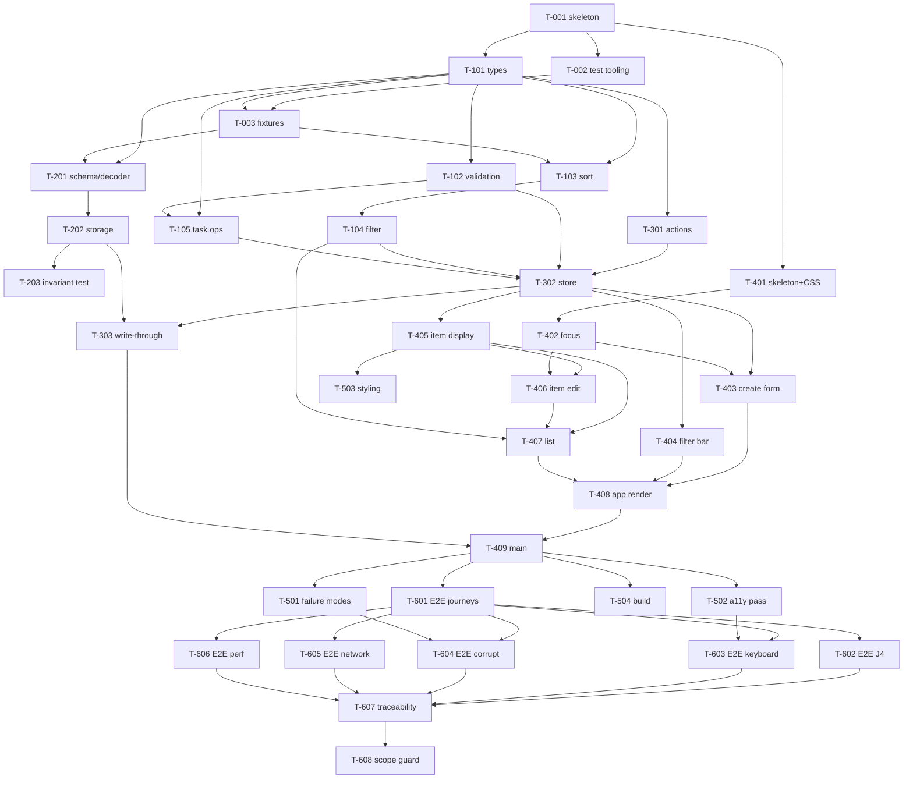

# Task Tracker — Implementation Plan

**Station:** 4 — Implementation Plan
**Inputs (authoritative, in precedence order):**
1. `Task Tracker.pdf` — Product Requirements Document, Status: Approved
2. `docs/01-requirements.md` — Station 1 (approved)
3. `docs/02-architecture.md` — Station 2 (approved)
4. `docs/03-architecture-decisions.md` + `docs/adr/0001`–`0008` — Station 3 (approved)

**Artifact status:** Derived. This plan sequences work to satisfy the approved requirements under the approved architecture. It adds no product behavior and makes no new architectural decisions. Where it appears to disagree with any input, the input wins.
**Last updated:** 2026-09-23

> **Filename note.** This file is `docs/03-plan.md` as instructed. Station 3's index already occupies `docs/03-architecture-decisions.md`, so two artifacts share the `03-` prefix. Harmless, but say the word and I will renumber this to `04-plan.md`.

---

## 0. How this plan is built

### 0.1 Task rules

Every task below satisfies four conditions:

1. **Small** — one sitting, one concern. No task spans two architectural layers.
2. **Independently verifiable** — it has a Definition of Done that can be checked without finishing the next task. Every task that produces logic ships its tests *with it*, not later.
3. **Traceable** — it names the acceptance criteria it serves, or is explicitly marked infrastructure.
4. **Bounded** — it names what it does *not* do, so scope cannot drift into it.

### 0.2 Layer-ordered sequencing

Work proceeds **inward-out**, following ADR-0001's dependency direction: `core/` → `persistence/` → `store/` → `ui/` → integration. Each layer is complete and tested before the layer that depends on it begins. This means the pure logic — where most acceptance criteria live — is proven before any DOM exists.

### 0.3 Size key

**S** ≈ under an hour · **M** ≈ half a day · **L** ≈ a day. Indicative only.

### 0.4 Scope guard

These must not appear in any commit. Each maps to an approved non-goal or constraint:

| Forbidden | Source |
| --- | --- |
| Any `fetch`, `XMLHttpRequest`, `WebSocket`, `sendBeacon`, service worker | C-01, `NFR-SEC-001`, `AC-SEC.1` |
| Any auth, login, account, or profile surface | NG-01, `AC-SEC.3` |
| Any `storage` event listener or `BroadcastChannel` | NG-07, architecture §7.5 |
| Task fields beyond the six in architecture §2.1 | C-03, NG-04, NG-05 |
| Reminders, notifications, overdue badges or overdue grouping | NG-06, `AC-010.6` |
| User-selectable sort, or priority affecting sort | ADR-0007, `AC-003.7` |
| Delete confirmation dialogs | `OQ-04` resolution, architecture §12 |
| A combined "all tasks" view | `OQ-05` resolution, architecture §5.3 |
| Any runtime dependency | ADR-0002 |

---

## 1. Phases

| Phase | Name | Tasks | Produces | Gate to exit |
| --- | --- | --- | --- | --- |
| **P0** | Scaffolding | T-001 – T-003 | Buildable empty project, three test tiers runnable | `npm run build` and all three test commands succeed on an empty suite |
| **P1** | Core domain | T-101 – T-105 | `src/core/` complete and pure | Unit tests green; `core/` imports nothing from siblings |
| **P2** | Persistence | T-201 – T-203 | `src/persistence/` complete | Decoder handles every corruption fixture; invariant test green |
| **P3** | Store | T-301 – T-303 | `src/store/` complete | Every action tested; write-through proven |
| **P4** | UI | T-401 – T-409 | `src/ui/` + `index.html` + styles; app runs | All journeys manually walkable; DOM tests green |
| **P5** | Hardening | T-501 – T-504 | Failure modes, accessibility, styling | Storage failures degrade correctly; keyboard-only pass in jsdom |
| **P6** | Integration & E2E | T-601 – T-608 | Playwright suite, perf check, traceability audit | Every acceptance criterion demonstrably verified |

**Why this order.** P1 before P2 because the decoder validates `core` types. P2 before P3 because the store persists. P3 before P4 because the UI dispatches. P4's first real task is **focus management (T-402)** — ADR-0002's principal risk — deliberately proven before the list that depends on it exists.

---

## 2. Phase P0 — Scaffolding

### T-001 · Project skeleton and build

**Size:** S · **Depends on:** — · **Traceability:** infrastructure (C-06, ADR-0002)

Initialize the project: `package.json`, `tsconfig.json` (strict, ES2020 target per architecture §12), `vite.config.ts`, `index.html` with a mount point, empty `src/main.ts`, empty `src/styles.css`. Create the directory skeleton from architecture §11.

**Does not:** add any runtime dependency (ADR-0002); write application logic.

**DoD:** `npm run dev` serves a blank page; `npm run build` emits `dist/`; TypeScript strict mode on with zero errors.

---

### T-002 · Test tooling for three tiers

**Size:** M · **Depends on:** T-001 · **Traceability:** ADR-0008

Configure Vitest with two projects — node (`tests/unit/`) and jsdom (`tests/dom/`) — and Playwright (`tests/e2e/`) against the Vite preview server. Add scripts: `test:unit`, `test:dom`, `test:e2e`, `test` (unit + dom).

**Does not:** write tests; add visual-regression tooling (ADR-0008 alternative D, rejected).

**DoD:** each command runs and reports zero tests without error; Playwright launches a browser.

---

### T-003 · Shared test fixtures and builders

**Size:** S · **Depends on:** T-002, T-101 · **Traceability:** ADR-0008

A `makeTask(overrides)` builder and a named set of task fixtures covering the ordering cases: dated/undated, shared due dates, same-millisecond `createdAt`, past and future dates, each priority, each status.

**Does not:** contain assertions.

**DoD:** importable from all three tiers; fixtures cover every branch of the ADR-0007 comparator.

---

## 3. Phase P1 — Core domain (pure)

> Every task in this phase produces code that imports **nothing** from `persistence/`, `store/`, or `ui/`, and touches neither DOM nor storage (ADR-0001).

### T-101 · `core/types.ts`

**Size:** S · **Depends on:** T-001 · **Traceability:** C-03, C-04, `AC-003.3`, architecture §2.1, §2.3

Define `Priority = 'low' | 'medium' | 'high'`, `Filter = 'active' | 'completed'`, `Task` (six fields exactly: `id`, `title`, `dueDate: string | null`, `priority: Priority | null`, `completed`, `createdAt`), and `AppState` (six fields per architecture §2.3).

**Does not:** add `updatedAt`, `completedAt`, `order`, `tags`, or `notes` — the attribute list is closed by C-03.

**DoD:** compiles; a fourth priority literal is a type error; `AppState` distinguishes `formError` from `editError`.

---

### T-102 · `core/validation.ts` — `validateTitle`

**Size:** S · **Depends on:** T-101 · **Traceability:** `FR-001`, `FR-009` · **AC:** AC-001.4, AC-009.1, AC-009.4, AC-005.6

One pure function returning `{ ok: true, value }` (trimmed) or `{ ok: false, message }`. Whitespace-only rejected (`OQ-06`). Shared by create and edit — this is what makes `AC-005.6` structural (ADR-0001, architecture §6.1).

**Does not:** enforce max length, date rules, or required priority — none is specified (architecture §6.2).

**Tests (unit):** empty; whitespace-only (spaces, tabs, newlines); valid; leading/trailing trim; **interior spacing preserved** (`AC-001.4`); unicode and emoji titles pass.

**DoD:** tests green; one exported function, no side effects.

---

### T-103 · `core/sort.ts` — the four-key comparator

**Size:** M · **Depends on:** T-101, T-003 · **Traceability:** `FR-010`, ADR-0005, ADR-0007 · **AC:** AC-010.1, AC-010.2, AC-010.5, AC-010.6, AC-010.7, AC-003.7

Implement keys in order: has-due-date (dated first) → `dueDate` lexicographic ascending → `createdAt` ascending → `id` ascending.

**Does not:** consider priority (`AC-003.7`); special-case past dates (`AC-010.6`); expose alternate orders.

**Tests (unit):** ascending by due date; undated group sorts last; **shared due date falls through to `createdAt`** (`OQ-01`); undated ordered among themselves by `createdAt` (`OQ-02`); identical `createdAt` falls through to `id` (key 4); past dates sort before future; priority permutations produce identical order (`AC-003.7`); **shuffling the input array produces an identical result** — the determinism check behind `AC-010.7`.

**DoD:** tests green; pure; no date parsing anywhere.

---

### T-104 · `core/filter.ts`

**Size:** S · **Depends on:** T-101, T-103 · **Traceability:** `FR-007` · **AC:** AC-007.1, AC-007.2, AC-007.3, AC-007.7, AC-010.5

A selector returning the visible list: filter by status, then sort with T-103. Filter-then-sort per architecture §5.1.

**Does not:** support a combined "all" view (`OQ-05`).

**Tests (unit):** active excludes completed and vice versa; every task lands in exactly one view; ordering holds inside both views; empty input returns empty.

**DoD:** tests green; result never written back to state.

---

### T-105 · `core/tasks.ts` — pure task operations

**Size:** M · **Depends on:** T-101, T-102 · **Traceability:** `FR-001`–`FR-006` · **AC:** AC-001.5, AC-001.6, AC-002.3–.5, AC-003.4, AC-003.5, AC-004.1, AC-004.3, AC-004.4, AC-005.1, AC-005.2, AC-005.7, AC-006.4

Pure functions: `createTask(input)` (generates `id` via `crypto.randomUUID()`, stamps `createdAt`, `completed: false`), `updateTask`, `toggleComplete`, `deleteTask`. All return new arrays/objects; none mutates.

**Does not:** touch storage or DOM; does not sort (T-103 owns order).

**Tests (unit):** created task is active (`AC-001.2`); title-only task is valid with null date and priority (`AC-001.5`); duplicate titles coexist independently (`AC-001.6`); set/change/clear due date (`AC-002.3–.5`); set/change/clear priority (`AC-003.4`, `AC-003.5`); toggle both directions preserves other fields (`AC-004.4`); editing a completed task keeps it completed (`AC-005.7`); delete leaves others untouched (`AC-006.4`).

**DoD:** tests green; no mutation of inputs (asserted).

---

## 4. Phase P2 — Persistence

### T-201 · `persistence/schema.ts` — envelope and total decoder

**Size:** M · **Depends on:** T-101, T-003 · **Traceability:** `FR-008`, `NFR-SUP-001`, ADR-0003, ADR-0005, ADR-0006 · **AC:** AC-008.5, AC-008.6, AC-SUP.1

`encode(tasks)` producing `{ schemaVersion: 1, tasks }`, and `decode(raw: string | null): Task[]` that **never throws** and returns `[]` on any failure. Field checks per ADR-0006: `id`/`title` non-empty strings, `dueDate` matching `YYYY-MM-DD` or `null`, `priority` in the closed set or `null`, `completed` boolean, `createdAt` number.

**Does not:** partially recover valid tasks (ADR-0006 alternative A, rejected); repair or coerce fields (alternative B); quarantine the corrupt payload (alternative D); use a validation library (alternative E).

**Tests (unit) — one fixture per case:** `null` input → `[]` (`AC-008.5`); invalid JSON; JSON that is an array, a number, a string; missing `schemaVersion`; `schemaVersion: 2`; `tasks` not an array; **one bad task among several valid ones → `[]`** (the all-or-nothing assertion); each field invalid in turn (bad priority `"urgent"`, `dueDate: "2026-13-45"`, `dueDate` as a `Date`, empty `title`, `completed` as string, missing `createdAt`); valid payload round-trips identically through `encode`/`decode` (`AC-008.1`).

**DoD:** tests green; `decode` provably total — no input throws.

---

### T-202 · `persistence/storage.ts` — the only `localStorage` module

**Size:** M · **Depends on:** T-201 · **Traceability:** ADR-0001, ADR-0003, ADR-0006 · **AC:** AC-008.3, AC-SUP.2, AC-SUP.3

`load(): { tasks, storageOk }` and `save(tasks): boolean`, under key `task-tracker.v1`. **Every** entry point wrapped in `try/catch`. Failure → `storageOk = false`, never a throw into callers. Handles all three failure modes in architecture §8.

**Does not:** register a `storage` event listener (NG-07); debounce (ADR-0004); write a backup key (ADR-0006).

**Tests (dom tier, storage faked):** load with no stored value; load with corrupt value; `getItem` throwing → `storageOk` false, app-usable empty list; `setItem` throwing (quota) → returns false, no throw; successful save then load round-trips.

**DoD:** tests green; only module in `src/` referencing `localStorage`.

---

### T-203 · Storage-isolation invariant test

**Size:** S · **Depends on:** T-202 · **Traceability:** ADR-0001, ADR-0006, ADR-0008 · **AC:** guards AC-SUP.1–.3

A test that scans `src/` and fails if any file outside `persistence/storage.ts` references `localStorage`, `sessionStorage`, or `document.cookie`.

**DoD:** passes now; demonstrably fails when a violation is introduced (verify by temporarily adding one).

---

## 5. Phase P3 — Store

### T-301 · `store/actions.ts`

**Size:** S · **Depends on:** T-101 · **Traceability:** architecture §3.2

A discriminated union of exactly the eight actions in architecture §3.2: `LOAD`, `CREATE_TASK`, `TOGGLE_COMPLETE`, `UPDATE_TASK`, `DELETE_TASK`, `SET_FILTER`, `BEGIN_EDIT`, `CANCEL_EDIT`.

**Does not:** add actions for unscoped behavior (no `SET_SORT`, no `CLEAR_COMPLETED`, no `UNDO`).

**DoD:** compiles; exhaustive `switch` over it type-checks without a default branch.

---

### T-302 · `store/store.ts` — reducer, dispatch, subscribe

**Size:** L · **Depends on:** T-301, T-102, T-105, T-104 · **Traceability:** `FR-001`–`FR-007`, `FR-009` · **AC:** AC-009.1, AC-009.3, AC-009.5, AC-005.6, plus the state half of AC-001.*, AC-002.*, AC-003.*, AC-004.*, AC-005.*, AC-006.*, AC-007.*

Pure reducer over `AppState`, plus `getState` / `dispatch` / `subscribe`. **Validation runs inside the reducer** for `CREATE_TASK` and `UPDATE_TASK` — it cannot be bypassed by dispatching directly (architecture §3.2). On failure, set `formError` / `editError` and leave `tasks` untouched.

**Does not:** touch storage (T-303 adds that); touch the DOM; sort (derived at render, ADR-0007).

**Tests (unit):** each action's state transition; `CREATE_TASK` with empty/whitespace title creates nothing and sets `formError` (`AC-009.1`); `UPDATE_TASK` with empty title leaves the task's previous title intact and sets `editError` (`AC-005.6`); a successful submit clears the error (`AC-009.5`); `SET_FILTER` does not touch `tasks`; `BEGIN_EDIT`/`CANCEL_EDIT` affect only `editingId`; subscribers fire once per dispatch.

**DoD:** tests green; reducer is pure.

---

### T-303 · Write-through persistence wiring

**Size:** M · **Depends on:** T-302, T-202 · **Traceability:** `NFR-REL-001`, ADR-0004 · **AC:** AC-008.4, AC-REL.1, AC-REL.2, AC-REL.3

Inside `dispatch`: if the action changed `tasks`, call `save()` **synchronously, before notifying subscribers** (architecture §3.3). A failed save sets `storageOk = false` and does not throw.

**Does not:** debounce, throttle, or defer (ADR-0004 alternatives A–D, all rejected); register `beforeunload`/`pagehide`/`visibilitychange` — **explicitly forbidden by `AC-REL.3`**.

**Tests (dom, storage faked):** save called exactly once per mutating action; **not** called for `SET_FILTER`, `BEGIN_EDIT`, `CANCEL_EDIT`, or a rejected create; save happens **before** the subscriber fires (ordering assertion); a throwing save leaves in-memory state correct and sets `storageOk` false; a grep-style test asserts no unload-family listener exists anywhere in `src/`.

**DoD:** tests green, including the ordering and no-unload-listener assertions.

---

## 6. Phase P4 — UI

### T-401 · Page skeleton and base styles

**Size:** M · **Depends on:** T-001 · **Traceability:** `NFR-A11Y-001` · **AC:** AC-A11Y.3 (baseline)

Semantic `index.html`: `<h1>`, a `<form>` region, a filter region, a list region. Base CSS: layout, typography, **visible focus indicator on every interactive element**, WCAG 2.1 AA contrast (architecture §9.6).

**Does not:** add a CSS framework or preprocessor (architecture §1.3); style task rows yet (T-405).

**DoD:** page renders; every focusable element has a visible focus ring; contrast checked.

---

### T-402 · `ui/focus.ts` — focus capture and restore

**Size:** L · **Depends on:** T-401 · **Traceability:** ADR-0002 (principal risk), architecture §4.3, §9.4 · **AC:** AC-A11Y.3

`captureFocus()` records the active element's `data-focus-key` plus cursor position; `restoreFocus(snapshot)` reinstates both after a rebuild, with a **defined fallback** when the element is gone: next task's Delete button, else the create-form title input.

> Scheduled first in P4 on purpose. This is the mechanism ADR-0002 accepts as its main cost; proving it before the list depends on it keeps the risk contained.

**Does not:** trap focus; implement roving `tabindex` (not needed — ADR index §3, `aria-pressed` buttons).

**Tests (dom):** focus survives a rebuild that preserves the element; cursor position preserved in a text input; element removed → fallback to next task's Delete; last task removed → fallback to title input; **focus is never left on `<body>`** after any rebuild.

**DoD:** all five situations from architecture §9.4 covered by a test.

---

### T-403 · `ui/taskForm.ts` — create form

**Size:** M · **Depends on:** T-302, T-401, T-402 · **Traceability:** `FR-001`, `FR-002`, `FR-003`, `FR-009` · **AC:** AC-001.1, AC-001.3, AC-001.7, AC-002.1, AC-002.2, AC-003.1, AC-003.2, AC-003.3, AC-009.2, AC-009.3, AC-009.5, AC-009.6

A real `<form>` with labelled `<input type="text">`, `<input type="date">`, and a `<select>` offering None/Low/Medium/High (architecture §9.1). Submit dispatches `CREATE_TASK`. Validation message in an `aria-live="assertive"` region, wired by `aria-describedby`, with `aria-invalid` on the input.

**Does not:** clear fields on a *failed* submit — `AC-009.3` requires the user's date and priority survive; clears only on success.

**Tests (dom):** valid submit adds a task and clears the fields; Enter submits; empty submit shows a **visible** message and adds nothing (`AC-009.2`); date and priority survive a failed submit (`AC-009.3`); next valid submit clears the message (`AC-009.5`); `aria-describedby`/`aria-invalid` wired (`AC-009.6`); the select offers exactly four options (`AC-003.3`); focus returns to the title input after a successful create (architecture §9.4).

**DoD:** tests green; no ARIA where a native element suffices.

---

### T-404 · `ui/filterBar.ts`

**Size:** S · **Depends on:** T-302, T-401 · **Traceability:** `FR-007` · **AC:** AC-007.1, AC-007.2, AC-007.6

Two `<button>`s in a labelled group with `aria-pressed` reflecting the current filter (architecture §9.3 — not a `tablist`, per the recorded rationale). Dispatches `SET_FILTER`.

**Does not:** add an "All" option (`OQ-05`).

**Tests (dom):** clicking switches the view; `aria-pressed` tracks state; both reachable by Tab alone; app opens on Active.

---

### T-405 · `ui/taskItem.ts` — display mode

**Size:** M · **Depends on:** T-302, T-401 · **Traceability:** `FR-003`, `FR-004`, `FR-006` · **AC:** AC-003.6, AC-004.1, AC-004.2, AC-004.3, AC-004.5, AC-004.7, AC-006.1, AC-006.5, AC-A11Y.2

One `<li>`: checkbox with a real `<label>`, title, due date, priority, Edit and Delete `<button>`s. Accessible names include the task title — `Delete "Buy milk"` (architecture §9.2). Completed tasks visually distinguishable by more than colour (`AC-004.7`, §9.6). Every control carries a stable `data-focus-key`.

**Does not:** show a delete confirmation (`OQ-04`); render an overdue badge (NG-06); display `id` or `createdAt`.

**Tests (dom):** accessible names include the title for all three controls (`AC-A11Y.2`); checkbox toggles in both directions; delete removes the row; priority is visible without opening edit (`AC-003.6`); completed styling is not colour-only; focus keys present and unique.

---

### T-406 · `ui/taskItem.ts` — inline edit mode

**Size:** M · **Depends on:** T-405, T-302, T-402 · **Traceability:** `FR-002`, `FR-003`, `FR-005` · **AC:** AC-002.3–.5, AC-003.4, AC-003.5, AC-005.1, AC-005.2, AC-005.3, AC-005.6, AC-005.7

Edit dispatches `BEGIN_EDIT`, swapping the row for an inline form over title, due date, priority. Save dispatches `UPDATE_TASK`; Cancel dispatches `CANCEL_EDIT`. Edit-mode validation message wired like T-403's.

**Does not:** allow editing status from this form (the checkbox owns that); persist a half-finished edit (architecture §2.3).

**Tests (dom):** all three fields editable (`AC-005.2`); clearing the title and saving is rejected, message shown, previous title intact (`AC-005.6`); clearing a due date works (`AC-002.5`); clearing a priority works (`AC-003.5`); a completed task is editable and stays completed (`AC-005.7`); focus moves into the title field on begin, and back to the Edit button on save or cancel (architecture §9.4).

---

### T-407 · `ui/taskList.ts`

**Size:** M · **Depends on:** T-405, T-406, T-104 · **Traceability:** `FR-007`, `FR-010` · **AC:** AC-007.5, AC-007.7, AC-010.3, AC-010.4, AC-010.5, AC-006.2, AC-006.6

Render `<ul>`/`<li>` from the T-104 selector. Empty state per view (`AC-007.5`). Full rebuild of the list region, bracketed by T-402's capture/restore (architecture §4.3).

**Does not:** cache or store the sorted order (ADR-0007); paginate or virtualize (no requirement).

**Tests (dom):** a new task appears in its **sorted position, not appended** (`AC-010.3`); editing a due date re-sorts immediately (`AC-010.4`); ordering holds in both views (`AC-010.5`); empty state in each view (`AC-007.5`); deleting the last task leaves an empty list without error (`AC-006.6`); a deleted task is absent from **both** views (`AC-006.2`).

---

### T-408 · `ui/app.ts` — render composition

**Size:** M · **Depends on:** T-403, T-404, T-407 · **Traceability:** architecture §4.2, §4.3

Subscribe to the store; on each change, capture focus → update form and filter bar in place → rebuild the list → restore focus. The form and filter bar are created once; only the `<ul>` is rebuilt.

**Does not:** read storage (ADR-0001); mutate state directly.

**Tests (dom):** one render per dispatch; focus preserved across a full cycle; no orphaned event listeners after repeated rebuilds.

---

### T-409 · `src/main.ts` — composition root

**Size:** S · **Depends on:** T-408, T-202, T-303 · **Traceability:** `FR-008` · **AC:** AC-008.3, AC-008.5

Startup sequence: `storage.load()` → `dispatch(LOAD)` → mount `ui/app`. Storage is read **once**, here, and never again (ADR-0001).

**Does not:** re-read storage on any later event.

**Tests (dom):** stored tasks appear with no user action (`AC-008.3`); empty storage yields an empty list (`AC-008.5`); corrupt storage yields a usable empty list (`AC-008.6`).

**DoD:** the app runs; all four journeys walkable by hand.

---

## 7. Phase P5 — Hardening

### T-501 · Storage failure-mode integration

**Size:** M · **Depends on:** T-409 · **Traceability:** `NFR-SUP-001`, ADR-0006 · **AC:** AC-SUP.1, AC-SUP.2, AC-SUP.3, AC-008.6

Drive all three failure modes from architecture §8 through the assembled app with an injectable storage fake.

**Does not:** add a user-facing warning message — architecture §8.1 leaves this **open and defaulted to silence**; adding one is a product decision, not an implementation choice.

**Tests (dom):** corrupt payload → empty, usable list, and the user can **immediately create a task** (`AC-SUP.3`); `getItem` throws → app usable in memory; `setItem` throws mid-session → UI stays responsive and correct, no crash.

---

### T-502 · Accessibility pass

**Size:** M · **Depends on:** T-409 · **Traceability:** `NFR-A11Y-001` · **AC:** AC-A11Y.1, AC-A11Y.2, AC-A11Y.3, AC-A11Y.5

Systematic sweep against architecture §9: every one of the five named control groups keyboard-operable; accessible names identify action **and** task; all five §9.4 focus situations verified together; validation messages announced and never colour-only; focus never lost to `<body>`.

**Tests (dom):** the complete §9.4 focus table as one suite; an accessible-name audit across a populated list.

---

### T-503 · Visual styling completion

**Size:** M · **Depends on:** T-401, T-405 · **Traceability:** `NFR-A11Y-001`, DO-2 · **AC:** AC-004.7, AC-003.6

Finish list, row, form, and empty-state styling. Completed tasks clearly distinguishable; priority legible as text or text-plus-colour, never colour alone. Works at narrow widths.

**Does not:** add animation, theming, or a component library.

**DoD:** contrast verified AA; layout holds from ~320 px up.

---

### T-504 · Build and static-deploy dry run

**Size:** S · **Depends on:** T-409 · **Traceability:** C-06

`vite build`, serve `dist/` as static files, walk all four journeys against the built artifact.

**DoD:** production build works from a plain static server; bundle contains no runtime dependency (ADR-0002).

---

## 8. Phase P6 — Integration and E2E verification

> Per ADR-0008, Tier 3 is deliberately small: only what jsdom cannot honestly verify.

### T-601 · E2E: journeys J1, J2, J3

**Size:** M · **Depends on:** T-409, T-002 · **AC:** AC-001.1, AC-001.3, AC-004.2, AC-005.3, AC-006.1, AC-006.2

Real browser, real event pipeline. Capture a task; complete and reopen it; edit and delete it. Assert no page reload occurs (`AC-001.3`).

---

### T-602 · E2E: journey J4 — reload and browser restart

**Size:** M · **Depends on:** T-601 · **AC:** AC-008.1, AC-008.2, AC-008.3, AC-006.3, AC-010.7

Create tasks with varied dates, priorities, and statuses. Reload → identical. **Close the browser context and reopen** → identical, including order (`AC-010.7`). A deleted task does not reappear (`AC-006.3`).

> This is the task that justifies Playwright's presence at all (ADR-0008 alternative B): jsdom cannot restart a browser.

---

### T-603 · E2E: keyboard-only traversal

**Size:** M · **Depends on:** T-601, T-502 · **AC:** AC-A11Y.1, AC-A11Y.4

All four journeys completed **with the keyboard alone**, no pointer events at any point. Real focus order, real native control behavior.

---

### T-604 · E2E: corrupt storage against the real API

**Size:** S · **Depends on:** T-601, T-501 · **AC:** AC-008.6, AC-SUP.1

Seed malformed data into genuine `localStorage`, load the app, assert a usable empty list and that a task can be created straight away.

---

### T-605 · E2E: network silence

**Size:** S · **Depends on:** T-601 · **AC:** AC-SEC.1, AC-SEC.2, AC-PERF.2

Intercept all network traffic; walk all four journeys; assert **zero requests carrying task data** and no analytics or telemetry of any kind.

---

### T-606 · E2E: performance at 500 tasks

**Size:** S · **Depends on:** T-601 · **AC:** AC-PERF.1, AC-PERF.3

Seed 500 tasks (the figure fixed in ADR-0008 — a test parameter, **not** a product limit). Measure create, edit, toggle, delete; each under 100 ms perceived latency.

---

### T-607 · Traceability audit

**Size:** M · **Depends on:** T-601 – T-606 · **Traceability:** the whole of `01-requirements.md`

Walk §9 of `01-requirements.md` criterion by criterion and confirm each has a passing test at its assigned tier. Produce a coverage table naming the test for every acceptance criterion. **Any criterion without a test is a defect**, not a documentation gap.

**DoD:** every `AC-*` maps to a named passing test.

---

### T-608 · Scope-guard review

**Size:** S · **Depends on:** T-607 · **Traceability:** §0.4 above; NG-01 – NG-07

Review the finished codebase against the scope-guard table: no network calls, no auth, no cross-tab listener, no extra task fields, no reminders, no alternate sort, no delete confirmation, no "all" view, zero runtime dependencies.

**DoD:** every row confirmed absent; `package.json` `dependencies` is empty.

---

## 9. Dependencies

### 9.1 Graph



### 9.2 Critical path

```
T-001 → T-101 → T-102 → T-105 → T-302 → T-303 → T-409 → T-601 → T-602 → T-607 → T-608
```

### 9.3 Parallelizable

| Can run concurrently | After |
| --- | --- |
| T-102, T-103, T-105 | T-101 |
| T-201 branch and T-301 branch | T-101 |
| T-403, T-404, T-405 | T-302 + T-402 |
| T-501, T-502, T-503, T-504 | T-409 |
| T-602, T-603, T-604, T-605, T-606 | T-601 |

### 9.4 Hard sequencing constraints

| Constraint | Why |
| --- | --- |
| T-402 before T-407 | Full list rebuild destroys focus; the restore mechanism must exist and be tested first (ADR-0002) |
| T-201 before T-202 | Storage depends on a total decoder (ADR-0006) |
| T-302 before T-303 | Write-through wraps an existing dispatch (ADR-0004) |
| T-103 before T-104 | The selector filters, then sorts (architecture §5.1) |
| T-102 before T-302 | Validation runs *inside* the reducer, not in the UI (architecture §3.2) |
| All of P6 before T-607 | The audit verifies tests that must already exist |

---

## 10. Traceability: acceptance criteria → tasks

| Criteria | Implementing task(s) | Verifying task(s) |
| --- | --- | --- |
| AC-001.1, .2, .3 | T-105, T-403 | T-403, T-601 |
| AC-001.4 | T-102 | T-102 |
| AC-001.5, .6 | T-105 | T-105 |
| AC-001.7 | T-403, T-409 | T-601 |
| AC-002.1, .2 | T-403 | T-403 |
| AC-002.3, .4, .5 | T-105, T-406 | T-105, T-406 |
| AC-002.6 | T-201, T-303 | T-602 |
| AC-002.7 | T-405 | T-405 |
| AC-003.1, .2, .3 | T-101, T-403 | T-403 |
| AC-003.4, .5 | T-105, T-406 | T-105, T-406 |
| AC-003.6 | T-405 | T-405, T-503 |
| AC-003.7 | T-103 | T-103 |
| AC-004.1, .3 | T-105, T-405 | T-405 |
| AC-004.2 | T-405, T-407 | T-405, T-601 |
| AC-004.4 | T-105 | T-105 |
| AC-004.5 | T-405 | T-606 |
| AC-004.6 | T-303 | T-602 |
| AC-004.7 | T-405, T-503 | T-405, T-503 |
| AC-005.1, .2, .3 | T-406 | T-406, T-601 |
| AC-005.4 | T-407 | T-407 |
| AC-005.5 | T-303 | T-602 |
| AC-005.6 | T-102, T-302, T-406 | T-102, T-302, T-406 |
| AC-005.7 | T-105, T-406 | T-105, T-406 |
| AC-006.1, .5 | T-405 | T-405, T-601 |
| AC-006.2 | T-407 | T-407, T-601 |
| AC-006.3 | T-303 | T-602 |
| AC-006.4 | T-105 | T-105 |
| AC-006.6 | T-407 | T-407 |
| AC-007.1, .2, .3 | T-104, T-404 | T-104, T-404 |
| AC-007.4 | T-407, T-408 | T-407 |
| AC-007.5 | T-407 | T-407 |
| AC-007.6 | T-404 | T-404, T-603 |
| AC-007.7 | T-104, T-407 | T-104, T-407 |
| AC-008.1, .2 | T-201, T-202, T-303 | T-602 |
| AC-008.3 | T-202, T-409 | T-409, T-602 |
| AC-008.4 | T-303 | T-303 |
| AC-008.5 | T-201, T-409 | T-201, T-409 |
| AC-008.6 | T-201, T-409 | T-201, T-501, T-604 |
| AC-008.7 | — (no network exists) | T-605 |
| AC-009.1, .4 | T-102, T-302 | T-102, T-302 |
| AC-009.2, .3, .5 | T-403 | T-403 |
| AC-009.6 | T-403 | T-403, T-502 |
| AC-010.1, .2, .6 | T-103 | T-103 |
| AC-010.3, .4 | T-407 | T-407 |
| AC-010.5 | T-104, T-407 | T-104, T-407 |
| AC-010.7 | T-103, T-201 | T-103, T-602 |
| AC-A11Y.1 | T-401, T-403–T-406 | T-502, T-603 |
| AC-A11Y.2 | T-405, T-406 | T-405, T-502 |
| AC-A11Y.3 | T-402 | T-402, T-502 |
| AC-A11Y.4 | T-402, T-403–T-406 | T-603 |
| AC-A11Y.5 | T-403, T-406 | T-403, T-502 |
| AC-SEC.1, .2, .3 | — (structural: no network layer) | T-605, T-608 |
| AC-PERF.1, .3 | T-408 | T-606 |
| AC-PERF.2 | — (structural) | T-605 |
| AC-REL.1, .2, .3 | T-303 | T-303, T-602 |
| AC-SUP.1, .2, .3 | T-201, T-202 | T-201, T-202, T-501, T-604 |

**Three criteria have no implementing task** — `AC-SEC.1/.2/.3` and `AC-PERF.2`. They are satisfied **structurally**: there is no network layer to remove, because none is ever built. They are nonetheless *verified*, by T-605 and T-608.

---

## 11. Exit criteria for Station 4 implementation

- [ ] All 30 tasks complete, each meeting its own DoD.
- [ ] `test:unit`, `test:dom`, `test:e2e` all green.
- [ ] T-607 coverage table shows a passing test for **every** acceptance criterion.
- [ ] T-608 confirms every scope-guard row absent; `dependencies` in `package.json` is empty.
- [ ] Production build runs from a static server (T-504).
- [ ] No ADR violated; no new architectural decision taken without a new ADR.
- [ ] `Task Tracker.pdf` and Stations 1–3 artifacts unmodified.

## 12. Carried-forward open items

Unchanged from architecture §8.1 and ADR index §5; neither blocks implementation. T-501 explicitly implements the current default (**silence**) and does not pre-empt the decision.

| Item | Default in this plan |
| --- | --- |
| Tell the user when storage is unavailable and tasks will not be saved? | No message |
| Tell the user when corrupt data degraded the list to empty? | No message |
